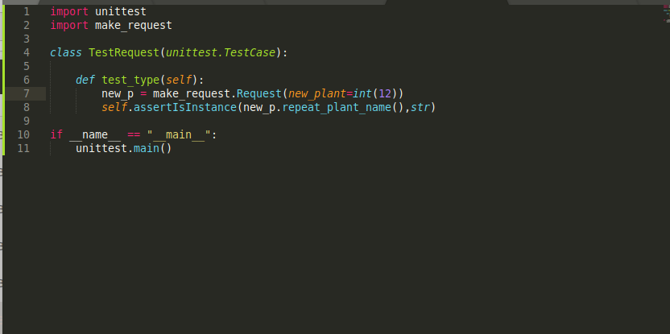
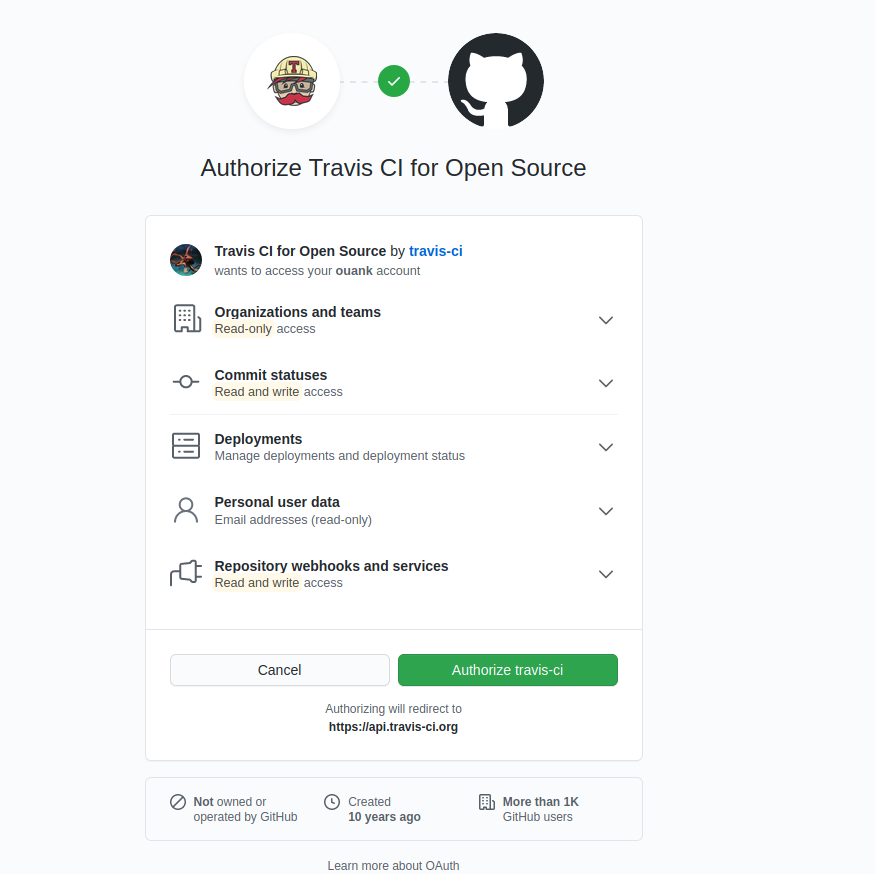

# Ejercicio 1 Instalar alguno de los entornos virtuales de node.js (o de cualquier otro lenguaje con el que se esté familiarizado) y, con ellos, instalar la última versión existente, la versión minor más actual de la 4.x y lo mismo para la 0.11 o alguna impar (de desarrollo).

# Ejercicio 2 Crear una descripción del módulo usando package.json. En caso de que se trate de otro lenguaje, usar el método correspondiente.

package.json file in [python](requirements.txt)

# Ejercicio 3 Descargar el repositorio de ejemplo anterior, instalar las herramientas necesarias (principalmente Scala y sbt) y ejecutar el ejemplo desde sbt. Alternativamente, buscar otros marcos para REST en Scala tales como Finatra o Scalatra y probar los ejemplos que se incluyan en el repositorio.

## Installa openjdk, scala, sbt:

## clone repository y ejecuta las pruebas

	$git clone git://github.com/JJ/spray-test MYREPNAME

va a la repository 

	$cd MYREPNAME

inicia sbt

	$sbt

esperar y ejecuta test

	> test

inicia la aplicación

	> re-start

va a localhost

Abre una nueva linea de comando y ejecuta una serie de pruebas

parar y cerrar la aplicación con

	> re-stop
	$exit

# Ejercicio 4 Para la aplicación que se está haciendo, escribir una serie de aserciones y probar que efectivamente no fallan. Añadir tests para una nueva funcionalidad, probar que falla y escribir el código para que no lo haga. A continuación, ejecutarlos desde mocha (u otro módulo de test de alto nivel), usando descripciones del test y del grupo de test de forma correcta. Si hasta ahora no has subido el código que has venido realizando a GitHub, es el momento de hacerlo, porque lo vamos a necesitar un poco más adelante.

## Running Normal Assert Testing
Run on Python Class for Project (draft)

trying to create a request, makes sure that the plant name is of type *string*.

 
Runs once successfully and once failed with the plantname as an sys.argv

In the failing example I changed the code to int(sys.argv[1]) as sys.argv always is a string.
It is an exception here, as in the real case the input argument won't be an sys.argv

## Now using high level test module unittest

Commented out the assertion, as it would otherwise trigger it first:

And failing mode when giving an int intentionally:

# Ejercicio 5 Ejercicio: Haced los dos primeros pasos antes de pasar al tercero.

    1.Darse de alta. Muchos están conectados con GitHub por lo que puedes usar directamente el usuario ahí. A través de un proceso de autorización, acceder al contenido e incluso informar del resultado de los tests.

Sign up at TRAVIS CI 

    2.Activar el repositorio en el que se vaya a aplicar la integración continua. Travis permite hacerlo directamente desde tu configuración; en otros se dan de alta desde la web de GitHub.

Activated Repository\

    3.Crear un fichero de configuración para que se ejecute la integración y añadirlo al repositorio.

created .travis.yml file and added to repository

