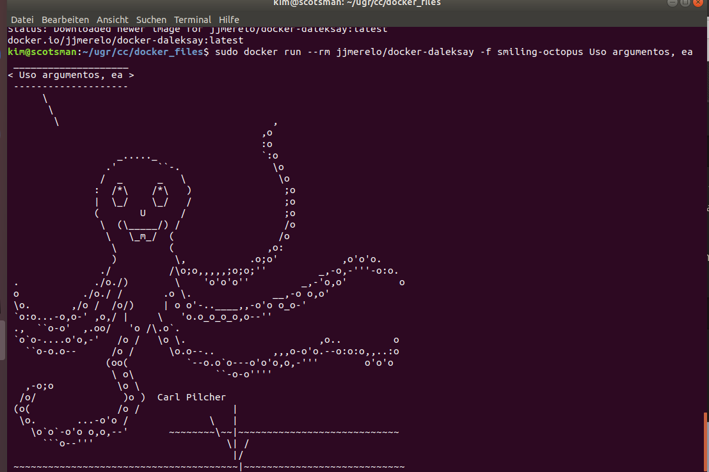

## Ejercicio 1:
Buscar alguna demo interesante de Docker y ejecutarla localmente, o en su defecto, ejecutar la imagen anterior y ver cómo funciona y los procesos que se llevan a cabo la primera vez que se ejecuta y las siguientes ocasiones.

