## Ejercicio 1:
Buscar alguna demo interesante de Docker y ejecutarla localmente, o en su defecto, ejecutar la imagen anterior y ver cómo funciona y los procesos que se llevan a cabo la primera vez que se ejecuta y las siguientes ocasiones.

## Ejercicio 2:
Tomar algún programa simple, “Hola mundo” impreso desde el intérprete de línea de órdenes, y comparar el tamaño de las imágenes de diferentes sistemas operativos base, Fedora, CentOS y Alpine, por ejemplo.

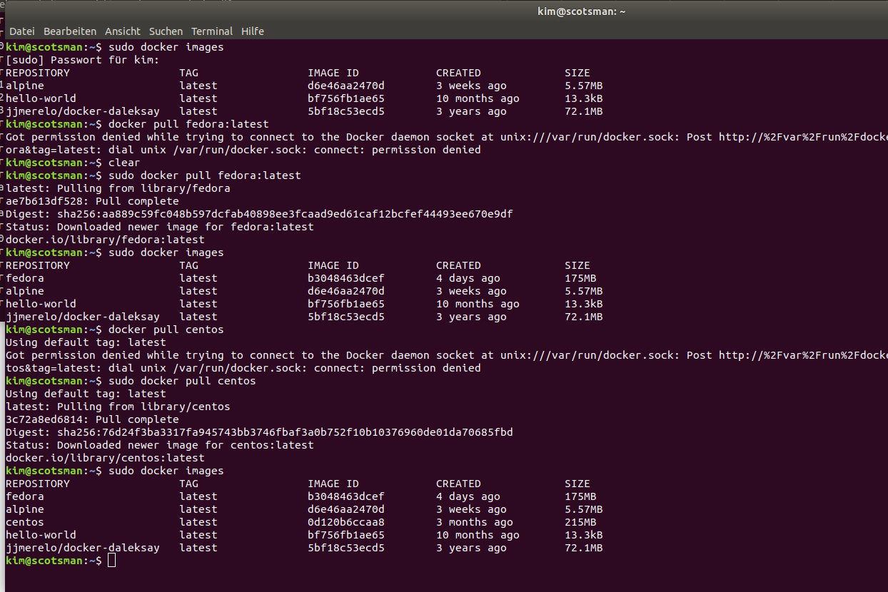

## Ejercicio 3:
Crear a partir del contenedor anterior una imagen persistente con commit.

we run alpine, create a random file, commit that docker image and have a modified docker image
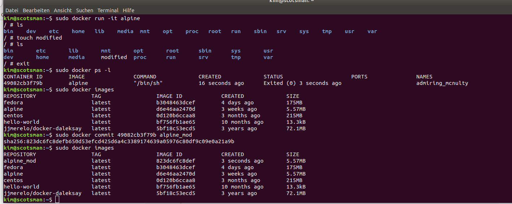

## Ejercicio 4:
Examinar la estructura de capas que se forma al crear imágenes nuevas a partir de contenedores que se hayan estado ejecutando.

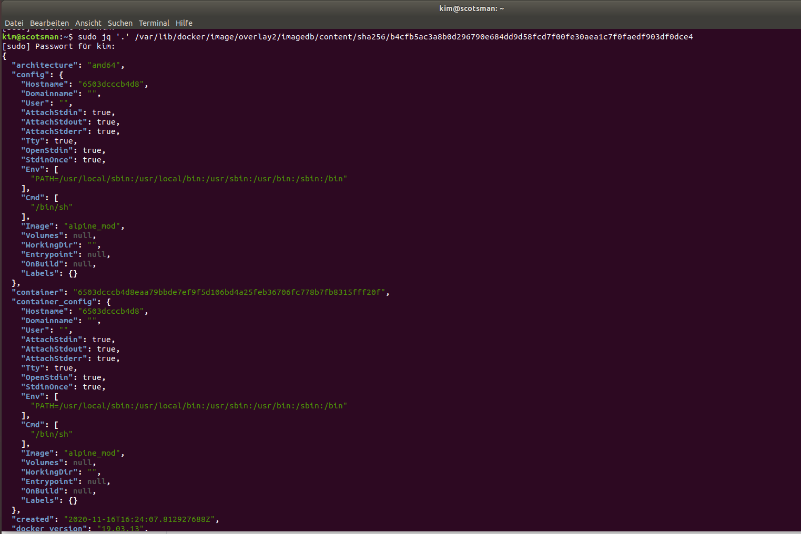
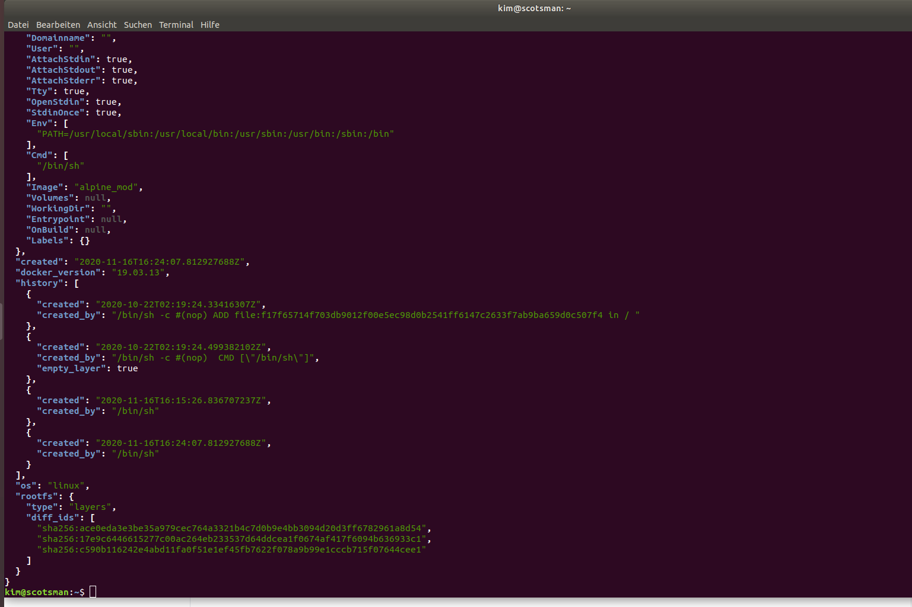

## Ejercicio 5:
Crear un volumen y usarlo, por ejemplo, para escribir la salida de un programa determinado.

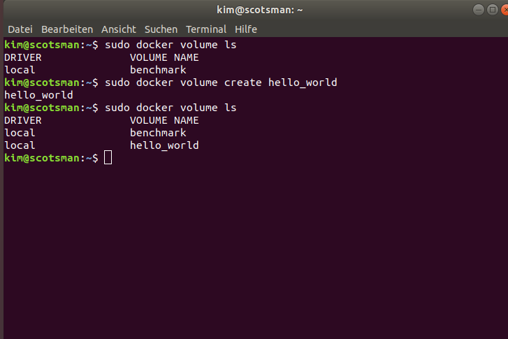
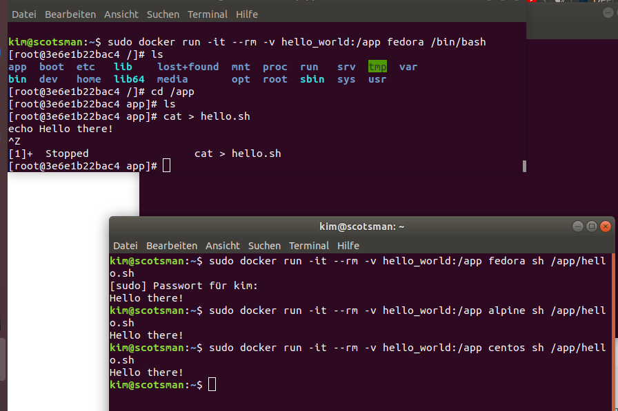

## Ejercicio 6:
Reproducir los contenedores creados anteriormente usando un Dockerfile.
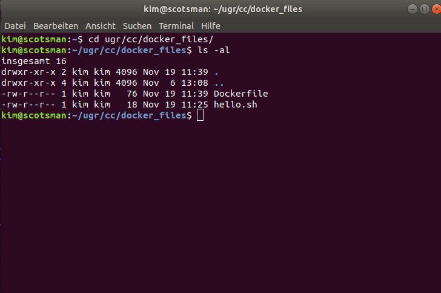
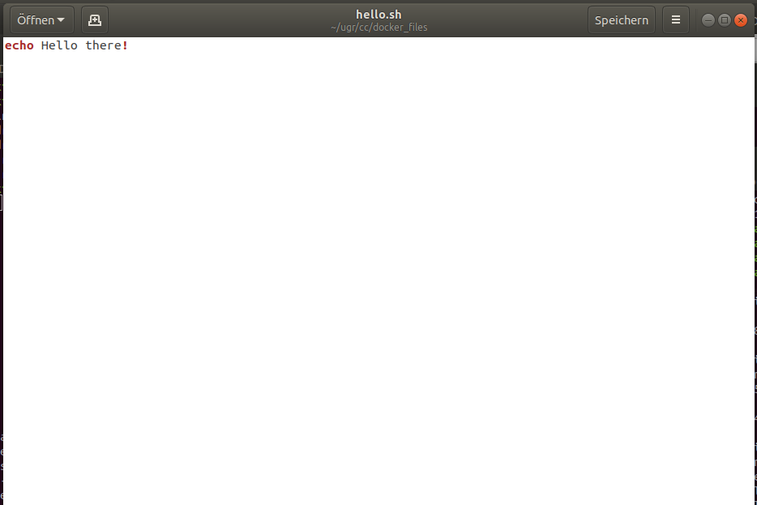
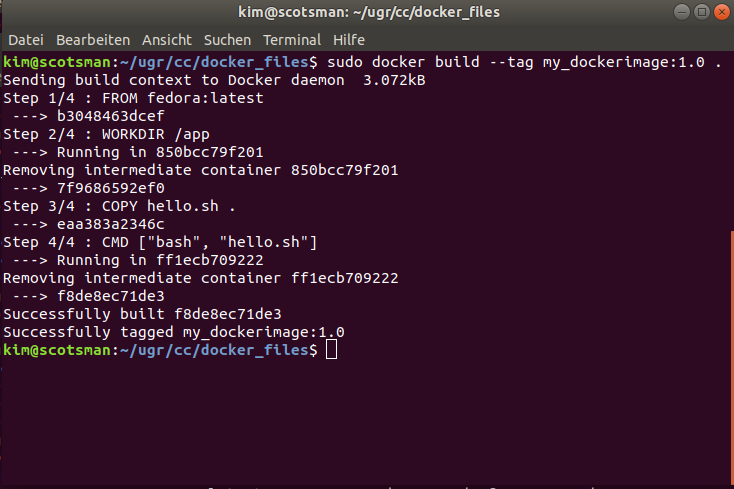
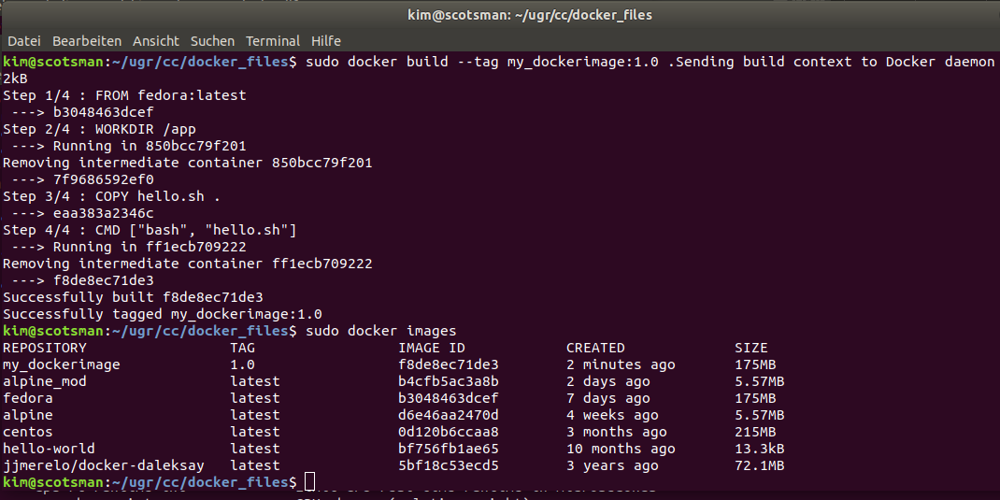
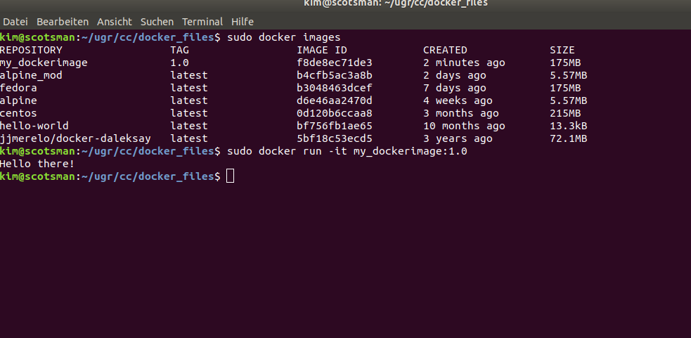

## Ejercicio 7:
Usar un miniframework REST para crear un servicio web y introducirlo en un contenedor, y componerlo con un cliente REST que sea el que finalmente se ejecuta y sirve como “frontend”.

