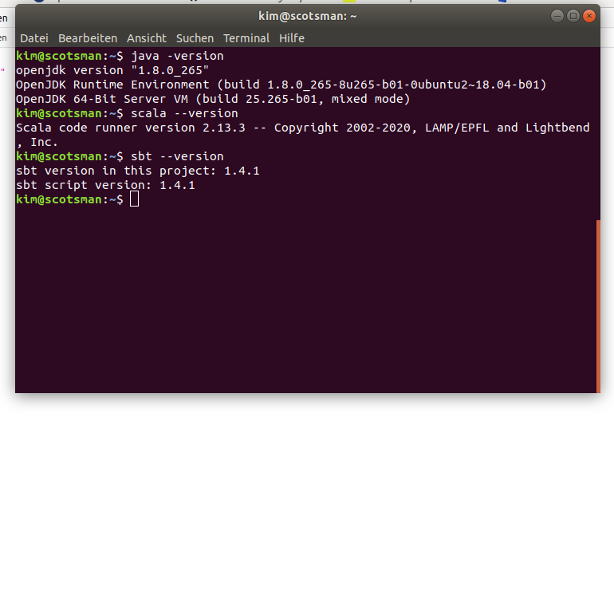
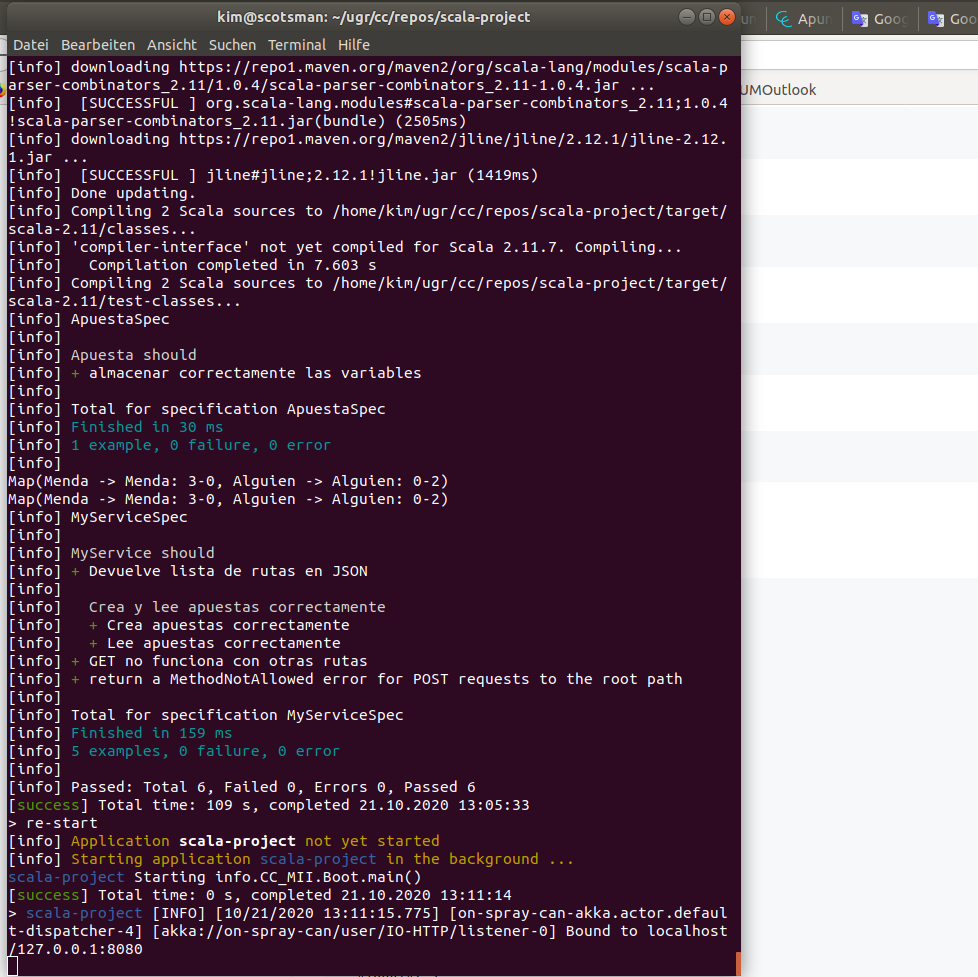
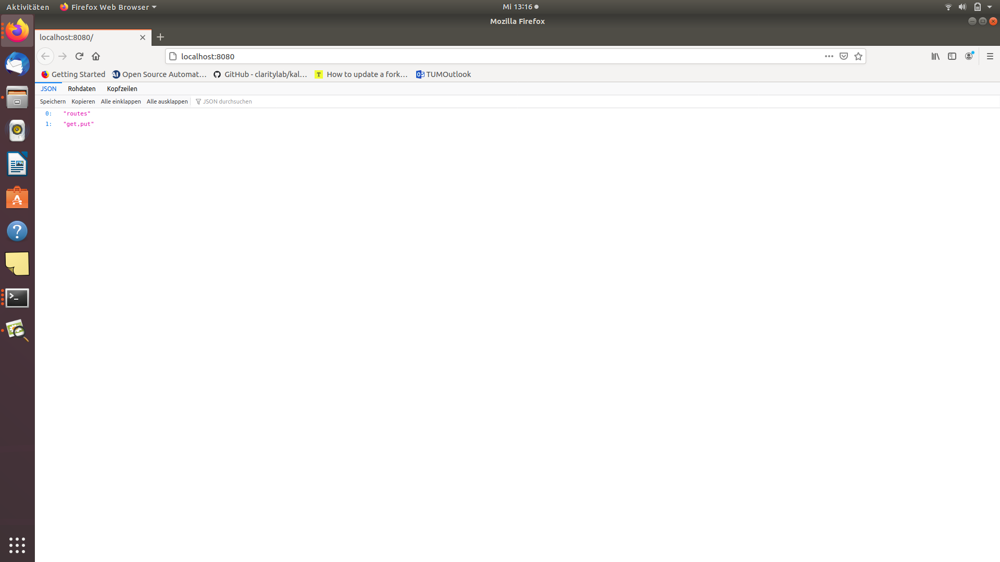
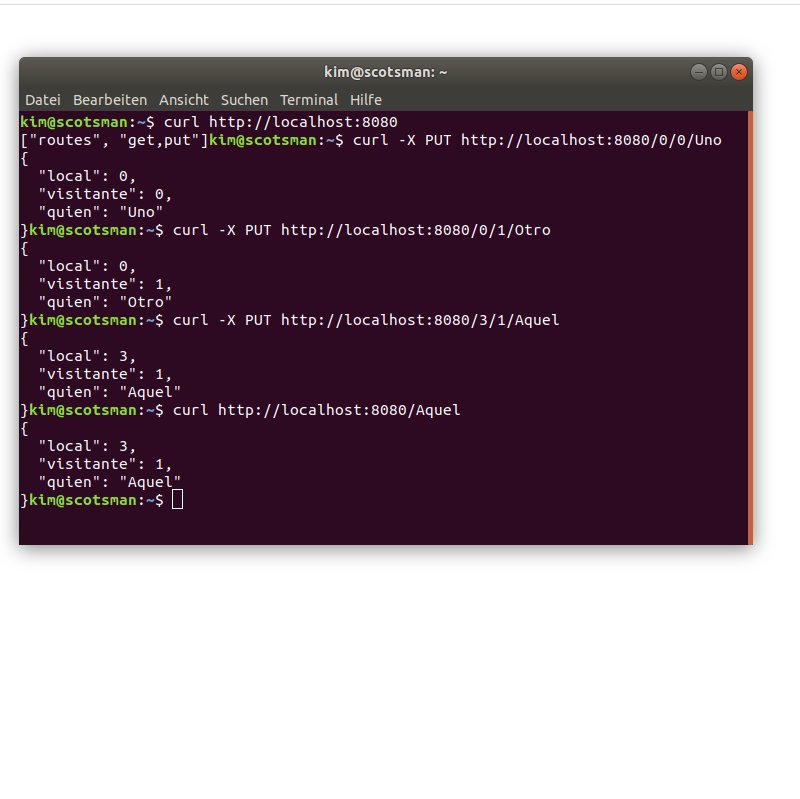

## Installa openjdk, scala, sbt:

## clone repository y ejecuta las pruebas

	$git clone git://github.com/JJ/spray-test MYREPNAME

va a la repository 

	$cd MYREPNAME

inicia sbt

	$sbt

esperar y ejecuta test

	> test

inicia la aplicación

	> re-start

va a localhost

Abre una nueva linea de comando y ejecuta una serie de pruebas

parar y cerrar la aplicación con

	> re-stop
	$exit

