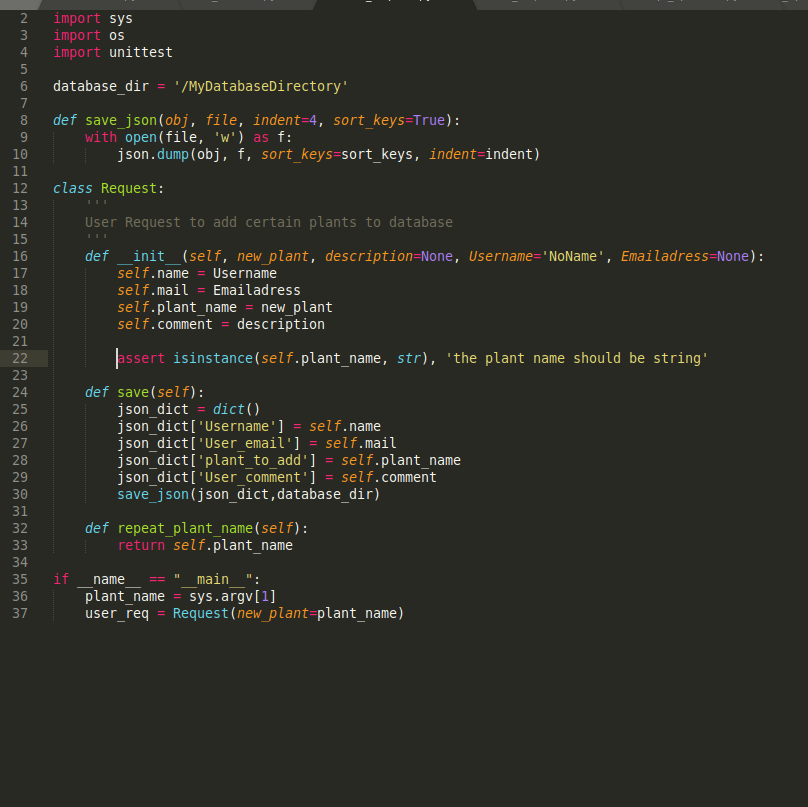
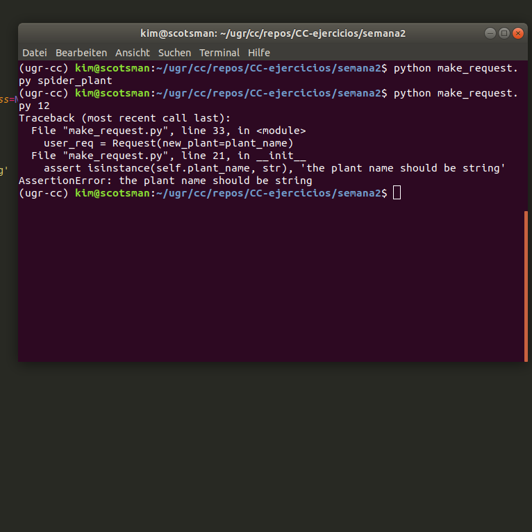
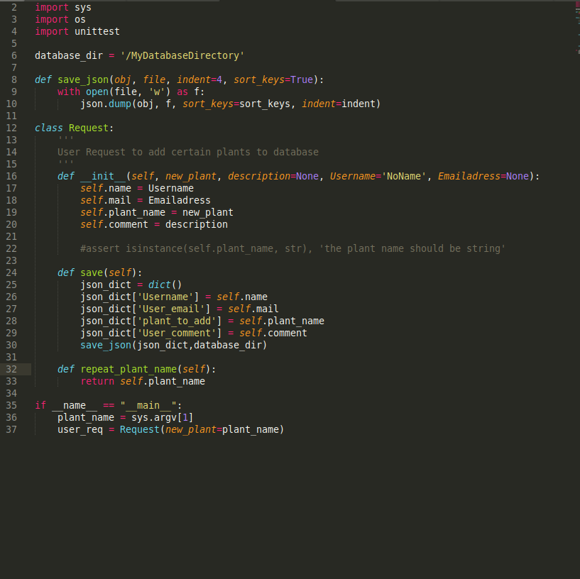
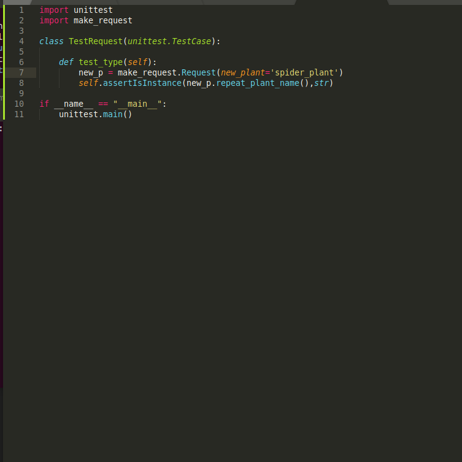
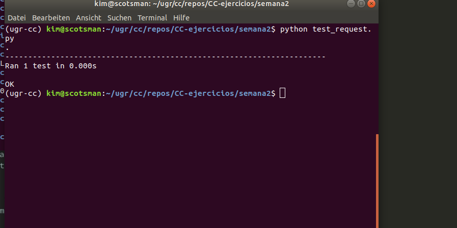
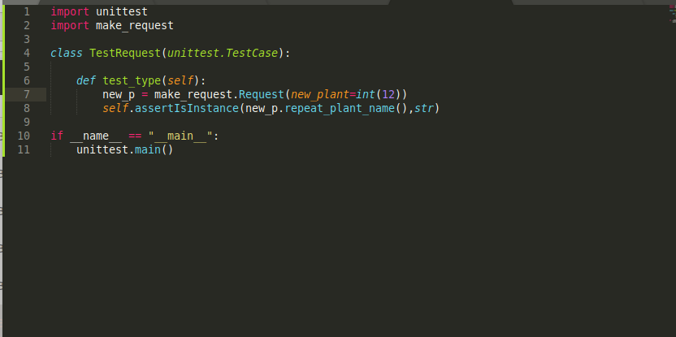
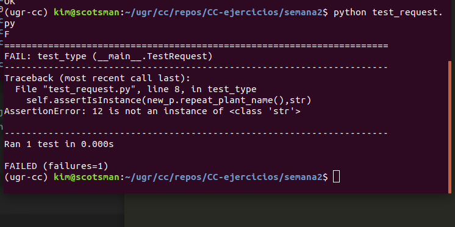

## Running Normal Assert Testing
Run on Python Class for Project (draft)

trying to create a request, makes sure that the plant name is of type *string*.

 
Runs once successfully and once failed with the plantname as an sys.argv

In the failing example I changed the code to int(sys.argv[1]) as sys.argv always is a string.
It is an exception here, as in the real case the input argument won't be an sys.argv

## Now using high level test module unittest

Commented out the assertion, as it would otherwise trigger it first:

And failing mode when giving an int intentionally:

